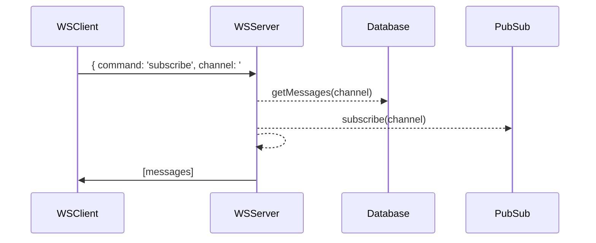
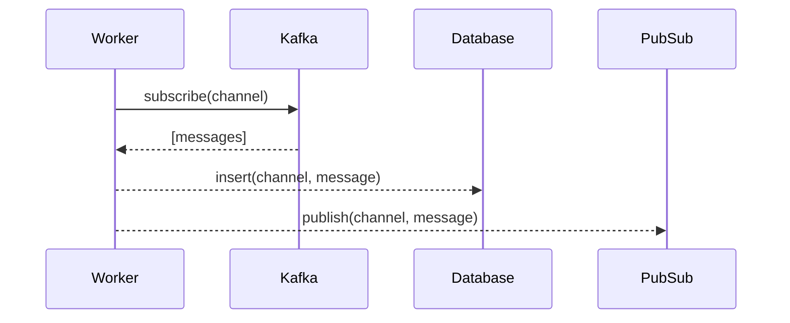

# Kerno's DevX Challenge

Howdy 👋  So... are you a legend?

We are in the lookout for beast-mode backend developers, mindful of architecture, data structures, performance and good engineering work — but whom always keep an eye on timely, customer-facing value delivery.

You are proficient in Java (or event better, Kotlin for backend), and have experience working with different programming paradigms (procedural, object-oriented, functional). You do understand the difference between a hammer and a screwdriver, and craft code that tells a story.  

**And don't be shy!**
We place great value in education and experience; but we also recognize that talent is built on passion and hours dedicated to deliberate practice and learning... so don't shy away from applying if you feel you have what it takes!

## The challenge:
You need to build a little event/stream-powered chat backend.

Here is the expected flow in a nutshell:
- Messages flow through a Kafka broker, you capture these messages and
	- ... place them in permanent storage 
	- ... as well as deliver them to a redis pubsub
- Write a websocket server that accepts **subscribe** events and:
	- ... returns the last N messages from permanent storage
	- ... and returns messages in real time from redis pubsub from the corresponding channel

You are free to structure the projects, choose frameworks and/or libraries as you see fit to deliver on this project. Also feel free to use any of the databases provided in the docker-compose file or add your own choice to it.

### Visual guideline
Here's a little example flow in case you need a little push to get going:

**WSServer flow:**

**StreamWorker flow:**

---

### Clone this project to get started!
Once you are happy with it, zip it and send it to dev-challenges@kerno.io for us to review.

The repository already contains a usable skeleton for the infra and the services required. Update the docker-compose file to match the initialization commands of your respective ws-server and messages-worker projects. Use Java, Kotlin or Scala at will. We are a Kotlin house, but it is not required that you use Kotlin for this challenge.

If you are short on time, address the messages-worker service and let us know when you send it to us.
We understand, we are all busy people ;)